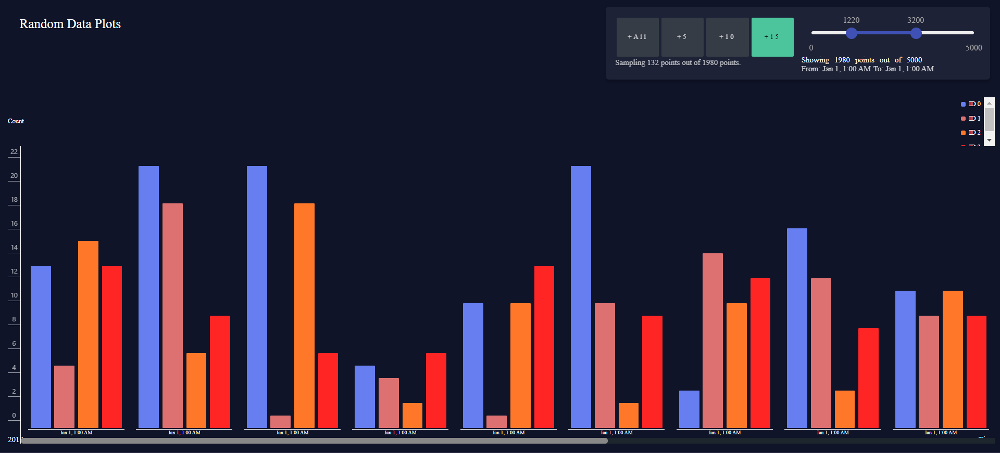
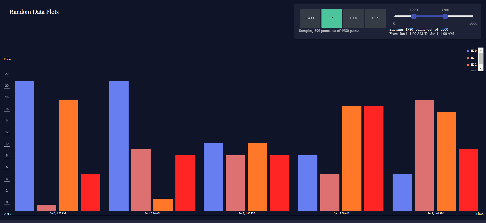

# This is a simple component which can be used to create eye catchy time series plotting.

The bar graph can plot over 5000 points ( even more ) data which can be looked at with ground level granularity. A small tool on top is used to set the interpolation of the graph, selecting the number of data points that has to be visualized. 

